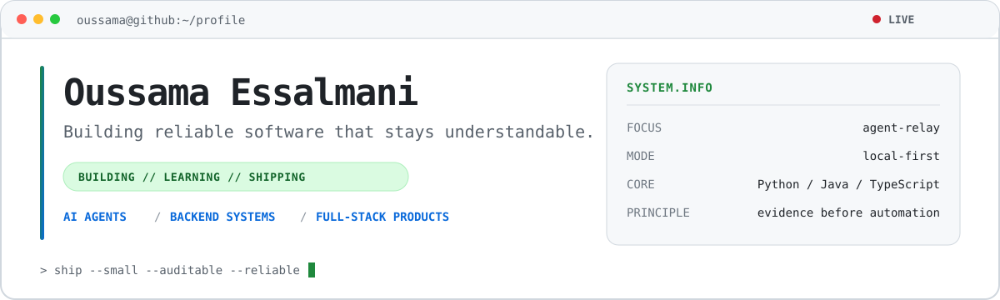

  <picture>
    <source media="(prefers-color-scheme: dark)" srcset="./assets/profile-banner-dark.svg" />
    <source media="(prefers-color-scheme: light)" srcset="./assets/profile-banner.svg" />
    
  </picture>

  
  
  

## About me

I'm a software engineer focused on **agentic developer tools**, **reliable backend systems**, and **practical AI products**. I like turning complex workflows into small, auditable tools—especially where multiple services or AI agents need to coordinate safely.

- Building local-first infrastructure for AI coding agents
- Exploring reliable distributed systems with Java, Spring, and event-driven architecture
- Shipping full-stack applications with TypeScript, Next.js, Node.js, and SQL

## Featured work

| Project | What it does | Built with |
| --- | --- | --- |
| [**Agent Relay**](https://github.com/Oussamoux1234/agent-relay) | Moves explicit, versioned task checkpoints between Codex, Claude, Gemini, Antigravity, and custom agents—with preview-first handoffs and safe fallback routing. | Python · CLI · JSON |
| [**Codex Council**](https://github.com/Oussamoux1234/codex-council) | Pressure-tests important decisions through independent advisors, anonymous peer review, deterministic aggregation, and bounded debate. | Python · Codex plugins · JSON Schema |
| [**Spring Cloud Microservices**](https://github.com/Oussamoux1234/microservices) | A multi-module backend with Eureka service discovery, an API gateway, load balancing, and independent user and product services. | Java 17 · Spring Boot · Spring Cloud · Maven |
| [**E-learning Platform**](https://github.com/Oussamoux1234/e-learning) | A full-stack learning application with a modern web client and an authenticated SQL-backed API. | Next.js · TypeScript · Tailwind CSS · Express · MySQL |

## Toolbox

  
  
  
  
  
  
  
  

## What I'm working on

Right now, I'm improving **Agent Relay**: a local-first continuity layer that lets user-owned AI agents share verified work state without transferring hidden reasoning or blindly repeating uncertain actions.

  <a href="https://github.com/Oussamoux1234?tab=repositories"><strong>Explore all projects →</strong></a>

